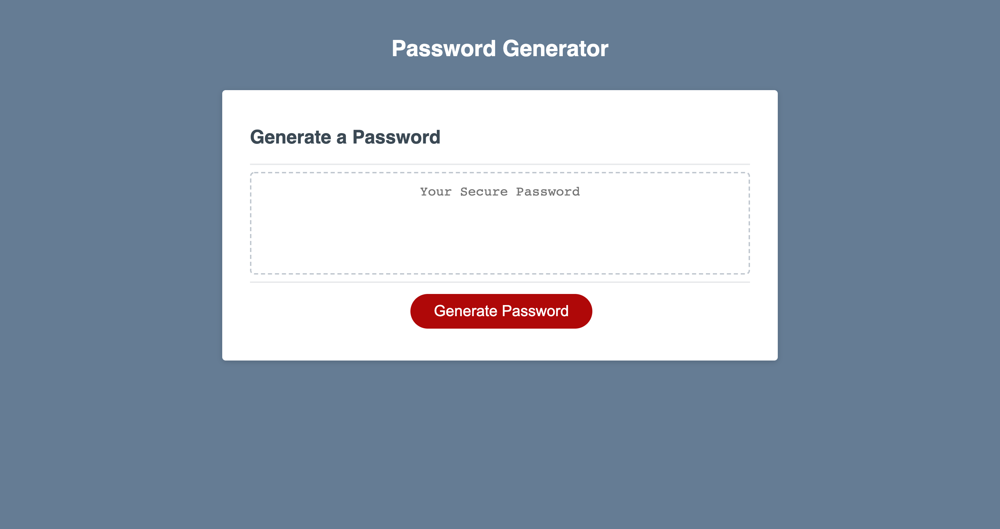

# Password Generator

## Description

This project was meet the criteria of a webpage that utilizes JavaScript in order to generate unique, random, passwords. The criteria for the password generator was that the webpage had to display various options regarding the nature and variations of the password when clicking the "Generate Password" button. The user can select options to use uppercase, lowercase, numerical, and special characters and must choose a length between 8 and 128 characters total. The deployed page has met all of these critera.

- [Installation](#installation)
- [Usage](#usage)
- [Credits](#credits)
- [License](#license)

## Installation

The files along with the assets folder were deployed using GitHub Pages and can be used to open up the webpage. The portfolio is hosted through GitHub pages, at: https://danielwestiner.github.io/password-generator/ The indivial files can be accessed through my personal GitHub repository located: https://github.com/DanielWestiner/password-generator

## Usage

The files can be viewed using any desktop browser for viewing.
The navigation can be used to browse different sections and will be updated as they become populated with projects.

## Credits

Collaborators on this project include the UPENN bootcamp cohort, teaching staff, and tutor Alexis San Javier who helped make edits to this project. Some concepts and syntax tips were learned from Colt Steele and his Udemy Bootcamp course.

## License

MIT License

Copyright (c) [2021] [Daniel Westiner]

Permission is hereby granted, free of charge, to any person obtaining a copy
of this software and associated documentation files (the "Software"), to deal
in the Software without restriction, including without limitation the rights
to use, copy, modify, merge, publish, distribute, sublicense, and/or sell
copies of the Software, and to permit persons to whom the Software is
furnished to do so, subject to the following conditions:

The above copyright notice and this permission notice shall be included in all
copies or substantial portions of the Software.

---
